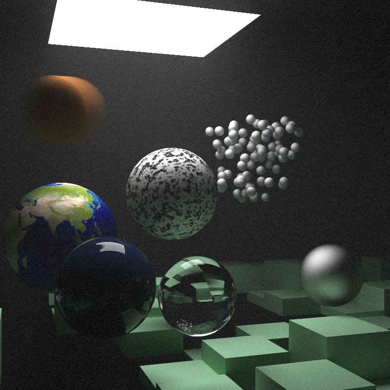

# PyTrace

A (nearly) pure Ray Tracing Project for Python

This work is based off the books [Ray Tracing: The Rest of Your Life](https://github.com/RayTracing/raytracingtherestofyourlife) by Peter Shirley but ported to Python. 

dependencies include: 
1. pypy3 (note all other dependencies must be installed within pypy3)
2. numpy 
3. matplotlib
4. tqdm
5. noise

## Quickstart guide: 
1. Install Anaconda
2. conda env create -f environment.yaml
3. conda activate PyTrace_env
4. pypy3 -m ensurepip
5. **if on mac you may need to fake a linked library described [here](https://bitbucket.org/pypy/pypy/issues/2942/unable-to-install-numpy-with-pypy3-on)**
6. pypy3 -m pip install -r requirements.txt
7. pypy3 main.py 
Technically, you can run w/o pypy3 installed but it is very slow w/o the JIT compilation, as seen below 

## Benchmarks: 
Note: Iterations per second are how many output pixels are processed per second 
 
